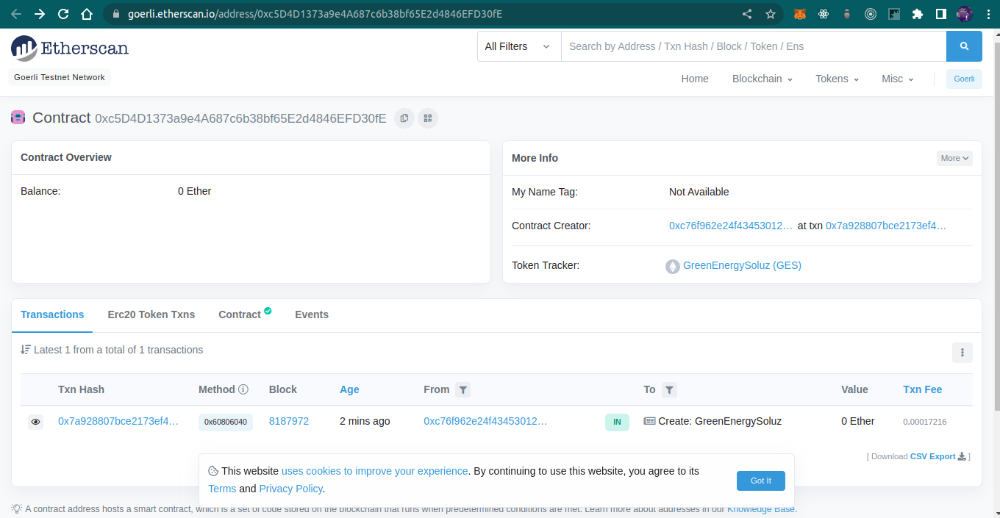
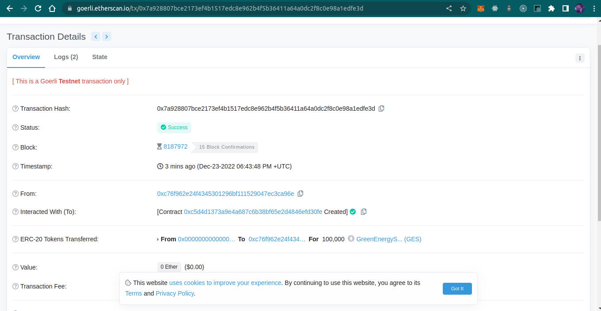

# Task - Inheritance

- Growic Solidity Developer Program

ERC20 Token Smart contract

ERC20 implementation from the OpenZepellin contracts using inheritance.

GES Token was created with Total supply of 100,000 and deployed to the goerli testnet.

## Sample Output I

## Sample Output II

- Token Contract Address:

0xc5D4D1373a9e4A687c6b38bf65E2d4846EFD30fE

- Token EtherScan Address:

https://goerli.etherscan.io/address/0xc5D4D1373a9e4A687c6b38bf65E2d4846EFD30fE#code
